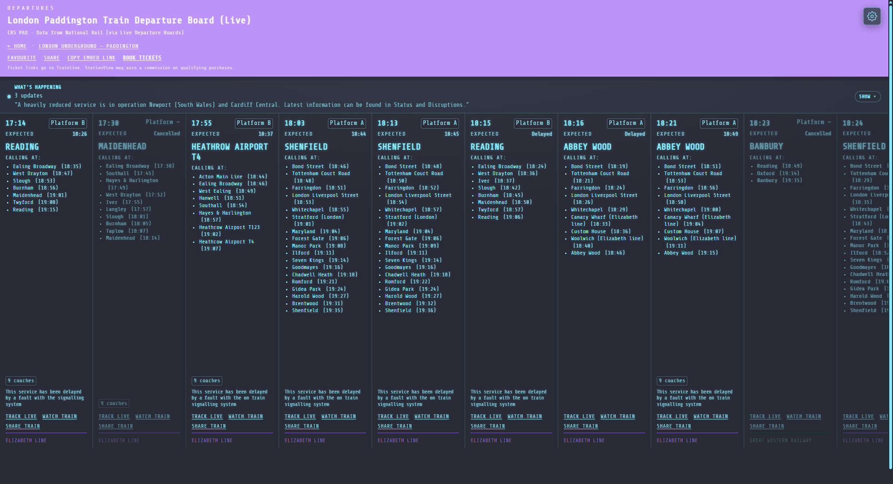

# Dracula for [StationView](https://stationview.app)

> A dark theme for [StationView](https://stationview.app) — live train departure boards with a Dracula palette.

## Install

All instructions can be found at [draculatheme.com/stationview](https://draculatheme.com/stationview).

Quick start: copy the share code from [`stationview-dracula.json`](stationview-dracula.json), open StationView **Settings → Theme → Custom**, and paste it into the import field.

## Team

This theme is maintained by the following person(s) and a bunch of [awesome contributors](https://github.com/dracula/stationview/graphs/contributors).

|  |
| ------------------------------------------------------------------------------------------- |
| [Ryan Cosans](https://github.com/ryancosans)                                                |

## Community

- [Twitter](https://twitter.com/draculatheme) - Best for getting updates about themes and new stuff.
- [GitHub](https://github.com/dracula/dracula-theme/discussions) - Best for asking questions and discussing issues.
- [Discord](https://draculatheme.com/discord-invite) - Best for hanging out with the community.

## Dracula PRO

## License

[MIT License](./LICENSE)
